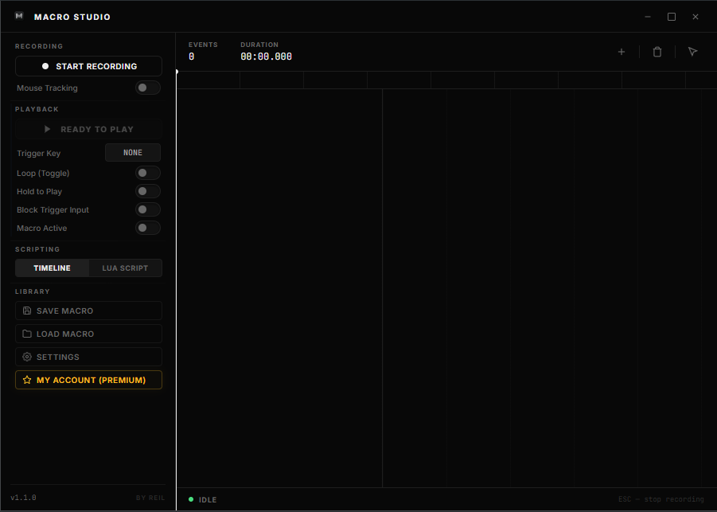
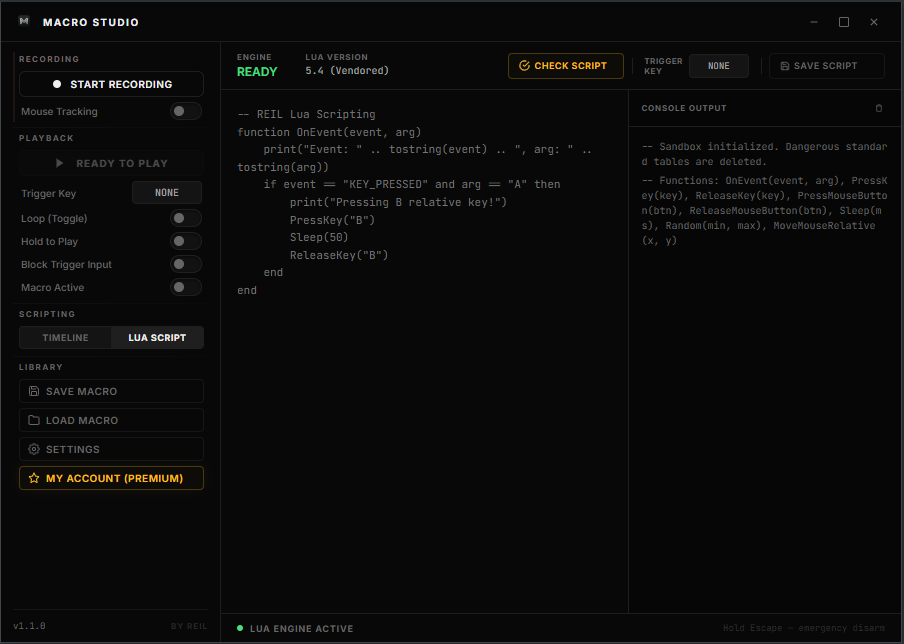
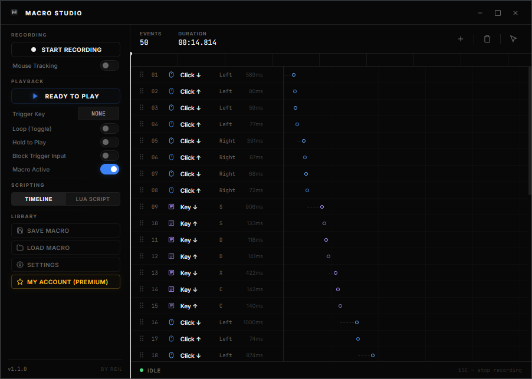

<p align="center">
  
</p>

# 🎛️ Macro Studio

[](#)
[](#)
[](#)
[](#)
[](#)

A **sleek, native, and ultra-lite macro engine** designed for power-users, developers, and automation enthusiasts. Built from the ground up using **Rust** and **Tauri v2** for zero-cost abstractions, minimal overhead, and absolute execution precision.

---

## 📸 Screenshots

### 1. Minimal Control Panel
<p align="center">
  
</p>

### 2. Sandbox Lua Scripting Engine (Premium)
<p align="center">
  
</p>

### 3. Precision Visual Timeline
<p align="center">
  
</p>

---

## ⚡ Core Highlights

* **🚀 Ultra-Lite Footprint:** Highly optimized native engine with a minimal resource footprint and virtually ~0% idle CPU overhead in the background.
* **🔒 Clean & Safe (External-Only):** Strictly utilizes standard, native OS-level simulation APIs. Macro Studio **NEVER** hooks into other process memories, injects kernel-level drivers, or performs suspicious system interventions.
* **🎚️ Dense Visual Timeline:** A beautifully crafted utility dashboard featuring:
  * Dynamic keyframe timeline ruler & playhead synchronization.
  * Drag-and-drop keyframe reordering.
  * Context-sensitive inline delay (`ms`) editors.
* **🎯 Precision Playback Control:**
  * **Loop & Toggle Modes:** Continuous execution with easy toggle controls.
  * **Hold-to-Play:** Execute actions only while holding a mapped shortcut.
  * **Key Swallowing:** Optionally block the physical keys you use to trigger macros, keeping the target application clean.
* **🛑 Hardware Emergency Disarm:** A built-in hardware fallback listener (default: hold `Escape` for 5s) to instantly disarm all background processes and release stuck inputs safely.

---

## 🪐 Lua Scripting Engine

Write highly custom, event-driven automation algorithms using a fully sandboxed, optimized **Lua 5.4 engine** mapped through native Rust bindings.
* Reactive scripts responding to live hardware triggers (`OnEvent(event, arg)`).
* Native APIs: `MoveMouseRelative(x, y)`, `PressKey(k)`, `ReleaseKey(k)`, `Sleep(ms)`, and more.
* Built-in execution timeout protection and automated stuck key cleanups.

---

## 💬 Community & Feedback

We'd love to hear your thoughts, feedback, and feature suggestions! 

* **Discord Community:** Join our community server via [Discord Invite Code: Dn2NUdmSqk](https://discord.gg/Dn2NUdmSqk) to chat, share scripts, and stay updated.
* **Feedback Email:** For business inquiries, custom requests, or general feedback, drop us a line at: 📧 **studioreas@mail.com**

---

## ⭐ Support the Project

If you find Macro Studio helpful, please consider giving us a star! Your support helps keep the project active and expanding.

<p align="center">
  <b>⭐ If you like this project, please give it a star! ⭐</b>
</p>

---

## 📦 Local Installation & Development

To clone, build, and run the Free Open-Core version locally, make sure you have the standard [Tauri Prerequisites](https://v2.tauri.app/start/prerequisites/) installed (Rust, Node.js, and C++ build tools).

### 1. Clone & Navigate
```bash
git clone https://github.com/devrookie66/macrostudio.git
cd macrostudio
```

### 2. Setup Dependencies
```bash
npm install
```

### 3. Run Development Build
```bash
npm run tauri dev
```

### 4. Build Release Package
```bash
npm run tauri build
```

---

## 📄 License

The Open-Core edition of Macro Studio is licensed under the [MIT License](LICENSE).
